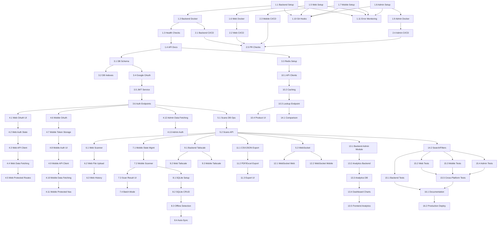

# Barcody - Modular Implementation Task List

> **Strategy**: Atomic tasks optimized for AI agent single-shot implementation
>
> **Structure**: 76 focused tasks, enhanced with critical implementation details
>
> **Goal**: 100% bug-free, production-ready implementation

---

## Index

### Phase 1: Foundation (Tasks 1-11)

- ✅ [1.1 Backend Project Setup](#task-11-backend-project-setup)
- ✅ [1.2 Backend Docker Setup](#task-12-backend-docker-setup)
- ✅ [1.3 Backend Health Checks](#task-13-backend-health-checks)
- ✅ [1.4 Backend API Documentation](#task-14-backend-api-documentation)
- ✅ [1.5 Web Project Setup](#task-15-web-project-setup)
- ✅ [1.6 Web Docker Setup](#task-16-web-docker-setup)
- ✅ [1.7 Mobile Project Setup](#task-17-mobile-project-setup)
- ✅ [1.8 Admin Dashboard Setup](#task-18-admin-dashboard-setup)
- ✅ [1.9 Admin Dashboard Docker Setup](#task-19-admin-dashboard-docker-setup)
- ✅ [1.10 Git Hooks & Code Quality Setup](#task-110-git-hooks--code-quality-setup)
- ⏳ [1.11 Error Monitoring Setup](#task-111-error-monitoring-setup)

### Phase 2: CI/CD Pipeline (Tasks 12-16)

- ✅ [2.1 Backend CI/CD](#task-21-backend-cicd)
- ✅ [2.2 Web CI/CD](#task-22-web-cicd)
- ✅ [2.3 Mobile CI/CD](#task-23-mobile-cicd)
- ✅ [2.4 Admin Dashboard CI/CD](#task-24-admin-dashboard-cicd)
- ✅ [2.5 PR Checks & Branch Protection](#task-25-pr-checks--branch-protection)

### Phase 3: Database & Auth Backend (Tasks 17-22)

- ✅ [3.1 Database Schema](#task-31-database-schema)
- ✅ [3.2 Database Indexes](#task-32-database-indexes--performance)
- ✅ [3.3 Redis Setup](#task-33-redis-setup)
- ✅ [3.4 Google OAuth Backend](#task-34-backend-auth---google-oauth)
- ✅ [3.5 JWT Service](#task-35-backend-auth---jwt-service)
- ✅ [3.6 Auth Endpoints](#task-36-backend-auth---endpoints)

### Phase 4: Auth Frontend (Tasks 23-35)

- ✅ [4.1 Web Auth - Google OAuth UI](#task-41-web-auth---google-oauth-ui)
- ✅ [4.2 Web Auth - State Management](#task-42-web-auth---state-management)
- ✅ [4.3 Web API Client Service](#task-43-web-api-client-service)
- ✅ [4.4 Web Data Fetching Setup](#task-44-web-data-fetching-setup)
- ✅ [4.5 Web Auth - Protected Routes](#task-45-web-auth---protected-routes)
- ⏳ [4.6 Mobile Auth - Google OAuth Flow](#task-46-mobile-auth---google-oauth-flow)
- ⏳ [4.7 Mobile Auth - Token Storage](#task-47-mobile-auth---token-storage)
- ⏳ [4.8 Mobile Auth - UI Components](#task-48-mobile-auth---ui-components)
- ⏳ [4.9 Mobile API Client Service](#task-49-mobile-api-client-service)
- ⏳ [4.10 Mobile Data Fetching Setup](#task-410-mobile-data-fetching-setup)
- ⏳ [4.11 Mobile Auth - Protected Navigation](#task-411-mobile-auth---protected-navigation)
- ✅ [4.12 Admin Dashboard Data Fetching](#task-412-admin-dashboard-data-fetching)
- ✅ [4.13 Admin Dashboard Authentication](#task-413-admin-dashboard-authentication)

### Phase 5: Scanning Backend (Tasks 36-38)

- ✅ [5.1 Scans Database Operations](#task-51-backend-scans---database-operations)
- ✅ [5.2 Scans API](#task-52-backend-scans---api)
- ✅ [5.3 WebSocket Gateway](#task-53-backend-scans---websocket-gateway)

### Phase 6: Scanning Web (Tasks 39-42)

- ✅ [6.1 Web Scanner](#task-61-web-scanner---camera-integration)
- ✅ [6.2 Web File Upload](#task-62-web-scanner---file-upload)
- ✅ [6.3 Web History](#task-63-web-scanner---history--management)
- ⏳ [6.4 Web PWA Configuration](#task-64-web-pwa-configuration)

### Phase 7: Scanning Mobile (Tasks 43-46)

- ⏳ [7.1 Mobile State Management](#task-71-mobile-state-management)
- ⏳ [7.2 Mobile Scanner](#task-72-mobile-scanner---camera-integration)
- ⏳ [7.3 Mobile Scan Result UI](#task-73-mobile-scanner---scan-result-ui)
- ⏳ [7.4 Mobile Batch Mode](#task-74-mobile-scanner---batch-mode)

### Phase 8: Offline-First Mobile (Tasks 47-50)

- ⏳ [8.1 SQLite Database Setup](#task-81-mobile-sqlite---database-setup)
- ⏳ [8.2 SQLite CRUD Operations](#task-82-mobile-sqlite---crud-operations)
- ⏳ [8.3 Offline Detection & UI](#task-83-mobile-offline---detection--ui)
- ⏳ [8.4 Auto-Sync](#task-84-mobile-offline---auto-sync)

### Phase 9: Tailscale Integration (Tasks 51-53)

- ✅ [9.1 Backend Tailscale Configuration](#task-91-backend-tailscale-configuration)
- ✅ [9.2 Web Tailscale Setup](#task-92-web-tailscale-setup-guide)
- ⏳ [9.3 Mobile Tailscale Integration](#task-93-mobile-tailscale-integration)

### Phase 10: Product Lookup (Tasks 54-57)

- ✅ [10.1 API Clients](#task-101-backend-product-lookup---api-clients)
- ✅ [10.2 Caching Strategy](#task-102-backend-product-lookup---caching)
- ✅ [10.3 Lookup Endpoint](#task-103-backend-product-lookup---endpoint)
- ✅ [10.4 Frontend Product Display - Web](#task-104-frontend-product-display-web)
- ⏳ [10.5 Frontend Product Display - Mobile](#task-104-frontend-product-display-mobile)

### Phase 11: Export Functionality (Tasks 58-60)

- ✅ [11.1 CSV & JSON Export](#task-111-backend-export---csv--json)
- ✅ [11.2 PDF & Excel Export](#task-112-backend-export---pdf--excel)
- ✅ [11.3 Frontend Export UI - Web](#task-113-frontend-export-ui-web)
- ⏳ [11.4: Frontend Export UI - Mobile](#task-113-frontend-export-ui-mobile)

### Phase 12: Real-Time Sync (Tasks 61-62)

- ✅ [12.1 WebSocket Client - Web](#task-121-websocket-client---web)
- ⏳ [12.2 WebSocket Client - Mobile](#task-122-websocket-client---mobile)

### Phase 13: Analytics Dashboard (Tasks 63-67)

- ⏳ [13.1 Backend Admin Module](#task-131-backend-admin-module)
- ⏳ [13.2 Analytics Backend](#task-132-analytics-backend---event-tracking)
- ⏳ [13.3 Analytics Database Schema](#task-133-analytics-database-schema)
- ⏳ [13.4 Admin Dashboard Charts & Metrics](#task-134-admin-dashboard---charts--metrics)
- ⏳ [13.5 Frontend Analytics Integration](#task-135-frontend-analytics-integration)

### Phase 14: Advanced Features (Tasks 68-69)

- ⏳ [14.1 Product Comparison](#task-141-product-comparison)
- ⏳ [14.2 Advanced Search & Filters](#task-142-advanced-search--filters)

### Phase 15: Testing & Quality (Tasks 70-74)

- ⏳ [15.1 Backend Testing](#task-151-backend-testing)
- ⏳ [15.2 Web Testing](#task-152-web-testing)
- ⏳ [15.3 Mobile Testing](#task-153-mobile-testing)
- ⏳ [15.4 Admin Dashboard Testing](#task-154-admin-dashboard-testing)
- ⏳ [15.5 Cross-Platform Testing](#task-155-cross-platform-testing)

### Phase 16: Deployment (Tasks 75-76)

- ⏳ [16.1 Documentation](#task-161-documentation)
- ⏳ [16.2 Production Deployment](#task-162-production-deployment)

---

## Phase 1: Foundation (Tasks 1-11)

### Task 1.1: Backend Project Setup

**Scope**: Initialize NestJS backend with core configuration

- [ ] Initialize NestJS project: `nest new backend`
- [ ] Configure `tsconfig.json` with strict mode and path aliases (`@/modules`, `@/common`, `@/config`)
- [ ] Create directory structure:
  - `src/common/` (decorators, filters, guards, interceptors, pipes)
  - `src/shared/services/` and `src/shared/utils/`
  - `src/database/migrations/` and `src/database/seeds/`
- [ ] Set up `.env.example`, `.env.development`, `.env.production`, `.env.test`
- [ ] Install core dependencies: `@nestjs/config`, `class-validator`, `class-transformer`, `winston`
- [ ] Create environment validation schema with all 11 required variables
- [ ] Configure Winston logger with log levels, JSON format, timestamps
- [ ] Configure API versioning: global prefix `/api/v1`
- [ ] Create logging interceptor in `common/interceptors/`
- [ ] Create HTTP exception filter in `common/filters/`
- [ ] Add validation on app bootstrap
- [ ] Test: `npm run start:dev` works
- [ ] Test: App fails with missing env vars
- [ ] Test: All endpoints accessible at `/api/v1/*`

**Acceptance**: Backend starts without errors, logger outputs JSON

---

### Task 1.2: Backend Docker Setup

**Scope**: Containerize backend with multi-stage build

- [ ] Create `Dockerfile` with optimized multi-stage build:
  - Use alpine base images
  - Builder stage + runner stage
  - Copy only production dependencies
  - Remove dev dependencies in final image
- [ ] Create comprehensive `.dockerignore` file
- [ ] Create `docker-compose.yml` with PostgreSQL, Redis, backend services
- [ ] Add named volumes for PostgreSQL data persistence
- [ ] Add named volumes for Redis data persistence
- [ ] Add health check to Dockerfile
- [ ] Configure environment variables in docker-compose
- [ ] Test: `docker-compose up -d` starts all services
- [ ] Test: Backend accessible at `localhost:8000`
- [ ] Test: Data persists after container restart
- [ ] Test: Production image size <200MB

**Acceptance**: All containers start, backend responds to requests

---

### Task 1.3: Backend Health Checks

**Scope**: Implement comprehensive health monitoring

- [ ] Install `@nestjs/terminus`
- [ ] Create `HealthModule`
- [ ] Implement `/health` endpoint (overall health)
- [ ] Implement `/health/db` endpoint (PostgreSQL check)
- [ ] Implement `/health/redis` endpoint (Redis check)
- [ ] Add health check to Docker Compose
- [ ] Test: All health endpoints return 200 OK

**Acceptance**: Health checks pass, Docker health status shows healthy

---

### Task 1.4: Backend API Documentation

**Scope**: Set up Swagger/OpenAPI documentation

- [ ] Install `@nestjs/swagger`
- [ ] Configure Swagger in `main.ts`
- [ ] Add API metadata (title, description, version)
- [ ] Create example DTO with decorators
- [ ] Test: Swagger UI accessible at `/api/docs`
- [ ] Verify: API documentation renders correctly

**Acceptance**: Swagger UI loads, shows API documentation

---

### Task 1.5: Web Project Setup

**Scope**: Initialize Next.js web application

- [ ] Initialize Next.js 14+: `npx create-next-app@latest web --typescript --tailwind --app`
- [ ] Configure `tsconfig.json` with path aliases (`@/components`, `@/lib`, `@/app`)
- [ ] Set up `.env.local.example`
- [ ] Install shadcn/ui: `npx shadcn-ui@latest init`
- [ ] Install shadcn/ui components: button, input, card, dialog, dropdown-menu, table, tabs, toast, select, checkbox, skeleton, badge, alert, separator
- [ ] Configure dark mode (default)
- [ ] Create basic layout with header
- [ ] Create `app/api/health/route.ts` (health check endpoint)
- [ ] Test: `npm run dev` works at `localhost:3000`
- [ ] Test: shadcn components render correctly

**Acceptance**: Web app loads with dark mode, Tailwind working

---

### Task 1.6: Web Docker Setup

**Scope**: Containerize web application

- [ ] Create `Dockerfile` with multi-stage build
- [ ] Create `.dockerignore`
- [ ] Add web service to `docker-compose.yml`
- [ ] Configure environment variables
- [ ] Test: `docker-compose up web` works
- [ ] Test: Web accessible at `localhost:3000`

**Acceptance**: Web container runs, app accessible

---

### Task 1.7: Mobile Project Setup

**Scope**: Initialize Expo mobile application

- [ ] Initialize Expo: `npx create-expo-app@latest mobile --template blank-typescript`
- [ ] Configure `app.json` (name: "Barcody", slug, version)
- [ ] Set up `eas.json` with build profiles (production, preview, development)
- [ ] Configure dark theme in `app.json`
- [ ] Design app icon (1024x1024px, neon blue theme) and generate all sizes
- [ ] Design splash screen (dark mode, neon blue) and configure in app.json
- [ ] Install navigation: `expo-router`
- [ ] Install optimization packages: `expo-image`
- [ ] Configure WebP format for all images
- [ ] Compress app icon and splash screen
- [ ] Create app/(tabs)/\_layout.tsx with tab configuration
- [ ] Configure tabs: Scan, History, Settings with icons
- [ ] Create placeholder screens for each tab with lazy loading
- [ ] Implement dynamic imports for heavy components
- [ ] Test: `npx expo start` works
- [ ] Test: Tab navigation works
- [ ] Test: Custom icon and splash screen show
- [ ] Test: Images load quickly

**Acceptance**: Mobile app runs in Expo Go, dark theme applied

---

### Task 1.8: Admin Dashboard Setup

**Scope**: Initialize admin dashboard application

- [ ] Initialize Next.js: `npx create-next-app@latest admin-dashboard --typescript --tailwind --app`
- [ ] Configure `tsconfig.json` with path aliases (`@/components`, `@/lib`, `@/app`)
- [ ] Set up `.env.local.example` with `NEXT_PUBLIC_API_URL`
- [ ] Install shadcn/ui: `npx shadcn-ui@latest init`
- [ ] Install shadcn/ui components: button, input, card, dialog, table, tabs, select, badge, alert, skeleton, dropdown-menu, separator
- [ ] Install axios: `npm install axios`
- [ ] Configure dark mode (default)
- [ ] Create basic dashboard layout with header
- [ ] Test: `npm run dev` works at `localhost:3000`
- [ ] Test: shadcn components render correctly

**Acceptance**: Admin dashboard loads with dark mode, Tailwind working

---

### Task 1.9: Admin Dashboard Docker Setup

**Scope**: Containerize admin dashboard

- [ ] Create `Dockerfile` with multi-stage build
- [ ] Create `.dockerignore`
- [ ] Add admin-dashboard service to root `docker-compose.yml` (port 3001)
- [ ] Configure environment variables in docker-compose
- [ ] Test: `docker-compose up admin-dashboard` works
- [ ] Test: Dashboard accessible at `localhost:3001`

**Acceptance**: Admin dashboard container runs, app accessible

---

### Task 1.10: Git Hooks & Code Quality Setup

**Scope**: Configure Husky, lint-staged, ESLint, Prettier, Commitlint for all projects

**Root Level:**

- [ ] Install Husky, lint-staged, Commitlint, Prettier (root)
- [ ] Configure lint-staged in root package.json for all projects
- [ ] Create `.prettierrc` with shared formatting rules
- [ ] Create `.prettierignore` file
- [ ] Create `commitlint.config.js` with conventional commit rules

**Backend (NestJS):**

- [ ] Install ESLint plugins: @typescript-eslint, eslint-plugin-import
- [ ] Create `.eslintrc.js` with NestJS rules (no `any`, import ordering)
- [ ] Add lint, format, type-check scripts to package.json

**Web (Next.js):**

- [ ] Install ESLint plugins: @typescript-eslint, eslint-config-next
- [ ] Create `.eslintrc.json` with Next.js + React hooks rules
- [ ] Add lint, format, type-check scripts to package.json

**Mobile (Expo):**

- [ ] Install ESLint plugins: @typescript-eslint, eslint-config-expo
- [ ] Create `.eslintrc.js` with React Native rules
- [ ] Add lint, format, type-check scripts to package.json

**Admin (Next.js):**

- [ ] Install ESLint plugins: @typescript-eslint, eslint-config-next
- [ ] Create `.eslintrc.json` with Next.js + React hooks rules
- [ ] Add lint, format, type-check scripts to package.json

**Git Hooks:**

- [ ] Initialize Husky: `npx husky install`
- [ ] Create `.husky/pre-commit` hook (lint-staged + type-check affected projects)
- [ ] Create `.husky/pre-push` hook:
  - Run unit tests only (not E2E tests for speed)
  - Run security audit: `npm audit --audit-level=high`
  - Exit with error if tests fail or vulnerabilities found
- [ ] Create `.husky/commit-msg` hook (commitlint validation)
- [ ] Make hooks executable: `chmod +x .husky/*`

**Testing:**

- [ ] Test: Commit with bad code (should fail)
- [ ] Test: Commit with good code (should auto-fix and pass)
- [ ] Test: Invalid commit message (should fail)
- [ ] Test: Valid commit message (should pass)
- [ ] Test: Push without tests passing (should fail)

**Acceptance**: All hooks working, code quality enforced, conventional commits required

---

### Task 1.11: Error Monitoring Setup

**Scope**: Configure Sentry for error tracking across all platforms

**Backend:**

- [ ] Install `@ntegral/nestjs-sentry`, `@sentry/node`
- [ ] Configure Sentry in `app.module.ts`
- [ ] Add SENTRY_DSN to environment variables
- [ ] Set environment (production/development)
- [ ] Test: Errors sent to Sentry

**Web:**

- [ ] Install `@sentry/nextjs`
- [ ] Run Sentry wizard: `npx @sentry/wizard@latest -i nextjs`
- [ ] Configure `sentry.client.config.ts`
- [ ] Configure `sentry.server.config.ts`
- [ ] Add SENTRY_DSN to `.env.local`
- [ ] Test: Errors tracked in Sentry dashboard

**Mobile:**

- [ ] Install `sentry-expo`
- [ ] Configure Sentry in `app.json`
- [ ] Add error boundary with Sentry
- [ ] Test: Crashes reported to Sentry

**Admin:**

- [ ] Install `@sentry/nextjs`
- [ ] Configure Sentry (same as Web)
- [ ] Add SENTRY_DSN to Vercel environment variables
- [ ] Test: Errors tracked in Sentry dashboard

**Acceptance**: Error monitoring configured on all platforms

---

## Phase 2: CI/CD Pipeline (Tasks 12-15)

### Task 2.1: Backend CI/CD

**Scope**: Automate backend Docker builds

- [ ] Create `.github/workflows/backend-build.yml`
- [ ] Configure Docker Buildx
- [ ] Add Docker Hub login step
- [ ] Implement multi-platform build (linux/amd64)
- [ ] Add semantic versioning tags
- [ ] Configure build caching
- [ ] Document required GitHub secrets in workflow comments:
  - DOCKERHUB_USERNAME, DOCKERHUB_TOKEN
- [ ] Test: Push to main triggers build
- [ ] Test: Docker image pushed to Docker Hub

**Acceptance**: Backend Docker image pushed to Docker Hub

---

### Task 2.2: Web CI/CD

**Scope**: Automate web Docker builds

- [ ] Create `.github/workflows/web-build.yml`
- [ ] Configure Docker Buildx
- [ ] Add Docker Hub login step
- [ ] Implement multi-platform build (linux/amd64)
- [ ] Add semantic versioning tags
- [ ] Configure build caching
- [ ] Document required GitHub secrets in workflow comments:
  - DOCKERHUB_USERNAME, DOCKERHUB_TOKEN
- [ ] Test: Push to main triggers build
- [ ] Test: Docker image pushed to Docker Hub

**Acceptance**: Web Docker image pushed to Docker Hub

---

### Task 2.3: Mobile CI/CD

**Scope**: Automate mobile APK builds

- [ ] Create `.github/workflows/mobile-build.yml`
- [ ] Configure EAS Build
- [ ] Add Expo token secret (EXPO_TOKEN)
- [ ] Document required GitHub secrets in workflow comments:
  - EXPO_TOKEN
- [ ] Implement APK build on tag push (`mobile-v*`)
- [ ] Upload APK to GitHub Releases
- [ ] Add release notes template
- [ ] Test: Tag push triggers build
- [ ] Test: APK uploaded to GitHub Releases

**Acceptance**: APK built and uploaded to GitHub Releases

---

### Task 2.4: Admin Dashboard CI/CD

**Scope**: Automate admin dashboard Docker builds

- [ ] Create `.github/workflows/admin-dashboard-build.yml`
- [ ] Configure Docker Buildx
- [ ] Add Docker Hub login step
- [ ] Implement multi-platform build (linux/amd64)
- [ ] Add semantic versioning tags
- [ ] Configure build caching
- [ ] Document required GitHub secrets in workflow comments:
  - DOCKERHUB_USERNAME, DOCKERHUB_TOKEN
- [ ] Test: Push to main triggers build
- [ ] Test: Docker image pushed to Docker Hub

**Acceptance**: admin dashboard Docker image pushed to Docker Hub

---

### Task 2.5: PR Checks & Branch Protection

**Scope**: Configure automated PR validation and merge gates

- [ ] Create `.github/workflows/pr-checks.yml`
- [ ] Configure workflow triggers: `pull_request` to `dev` branch
- [ ] Add lint job:
  - Run ESLint for backend, web, mobile, admin-dashboard
  - Fail workflow if linting errors found
- [ ] Add type-check job:
  - Run TypeScript compiler in strict mode
  - Check backend, web, mobile, admin-dashboard
- [ ] Add test job:
  - Run Jest unit tests for backend, web, mobile, admin-dashboard
  - Exclude E2E tests (too slow for PR checks)
  - Generate coverage report
- [ ] Add build job:
  - Verify backend builds successfully
  - Verify web builds successfully
  - Verify mobile builds successfully (Expo)
  - Verify admin-dashboard builds successfully
- [ ] Create `.github/CONTRIBUTING.md` with git workflow documentation:
  - Branch strategy: `task-X.Y-description` from `dev`
  - Commit convention: conventional commits (feat, fix, docs, etc.)
  - PR process: create, review, automated checks, merge
  - Code review guidelines
- [ ] Document merge requirements in CONTRIBUTING.md
- [ ] Enable branch protection for `dev` branch (GitHub Settings → Branches)
- [ ] Configure protection rules:
  - Require status checks to pass before merging
  - Require branches to be up to date before merging
  - Select required checks: `pr-checks` workflow
- [ ] Test: Create test PR with intentional failing test
- [ ] Test: Verify merge button is disabled (red X)
- [ ] Test: Fix test and push
- [ ] Test: Verify merge button enabled (green checkmark)
- [ ] Test: Verify cannot bypass checks (even as admin)

**Acceptance**: PRs cannot merge to dev if lint, type-check, test, or build fails for any project

---

## Phase 3: Database & Auth Backend (Tasks 16-21)

### Task 3.1: Database Schema Setup

**Scope**: Create PostgreSQL schema with TypeORM

- [ ] Install TypeORM: `@nestjs/typeorm`, `typeorm`, `pg`
- [ ] Configure TypeORM in `AppModule` with connection pooling:
  - max: 50 connections
  - min: 10 connections
  - idleTimeoutMillis: 30000
  - connectionTimeoutMillis: 2000
- [ ] Create `backend/src/config/typeorm.config.ts` with DataSource export
- [ ] Create migrations directory: `backend/src/migrations/`
- [ ] Create seeds directory: `backend/src/database/seeds/`
- [ ] Create `User` entity (id UUID, google_id, email, created_at, last_login)
- [ ] Create `Session` entity (id UUID, user_id, session_token, expires_at)
- [ ] Create `Scan` entity (id UUID, user_id, barcode_data, barcode_type, raw_data, scanned_at, device_type, metadata JSONB)
- [ ] Add migration scripts to package.json (migration:generate, migration:run, migration:revert, seed)
- [ ] Generate migration: `npm run migration:generate -- -n InitialSchema`
- [ ] Create rollback migration with down() method containing DROP TABLE statements in reverse order
- [ ] Ensure rollback drops tables: scans, sessions, users (in that order)
- [ ] Create seed script with development data (1 user, 50 scans, various types)
- [ ] Create test directory structure: test/unit/, test/integration/, test/e2e/, test/fixtures/, test/helpers/
- [ ] Test: Migration runs up successfully
- [ ] Test: Migration rolls back successfully without errors
- [ ] Test: `npm run seed` populates database
- [ ] Test: Connection pool works under load

**Acceptance**: Database tables created, entities working

---

### Task 3.2: Database Indexes & Optimization

**Scope**: Add performance indexes

- [ ] Add index on `users.google_id`
- [ ] Add index on `sessions.session_token`
- [ ] Add composite index on `scans(user_id, scanned_at DESC)`
- [ ] Add index on `scans.barcode_data`
- [ ] Generate migration for indexes
- [ ] Test: Indexes created successfully

**Acceptance**: All indexes exist, query performance improved

---

### Task 3.3: Redis Setup

**Scope**: Configure Redis for caching and sessions

- [ ] Install `@nestjs/cache-manager`, `cache-manager-redis-store`, `ioredis`
- [ ] Create `RedisModule`
- [ ] Configure Redis connection from environment
- [ ] Implement cache service wrapper
- [ ] Add health check for Redis
- [ ] Test: Redis connection works
- [ ] Test: Cache set/get works

**Acceptance**: Redis connected, caching functional

---

### Task 3.4: Auth Module - Google OAuth Strategy

**Scope**: Implement Google OAuth authentication

- [ ] Install `@nestjs/passport`, `passport`, `passport-google-oauth20`
- [ ] Create `AuthModule`
- [ ] Implement Google OAuth strategy
- [ ] Configure Google OAuth credentials from env
- [ ] Create auth controller with Google routes
- [ ] Test: OAuth redirect works
- [ ] Test: Callback receives user data

**Acceptance**: Google OAuth flow completes, user data received

---

### Task 3.5: Auth Module - JWT Service

**Scope**: Implement JWT token generation and validation

- [ ] Install `@nestjs/jwt`
- [ ] Create `JwtService` wrapper
- [ ] Implement access token generation (15min expiry)
- [ ] Implement refresh token generation (7 days expiry)
- [ ] Create JWT validation logic
- [ ] Store refresh tokens in Redis
- [ ] Test: Tokens generated and validated

**Acceptance**: JWT tokens work, validation passes

---

### Task 3.6: Auth Module - Endpoints & Guards

**Scope**: Create auth endpoints and protection

- [ ] Create `POST /auth/google` endpoint (exchange code for JWT)
- [ ] Create `POST /auth/refresh` endpoint (refresh access token)
- [ ] Create `POST /auth/logout` endpoint (invalidate session)
- [ ] Create `GET /auth/me` endpoint (get current user)
- [ ] Implement `JwtAuthGuard`
- [ ] Add guard to protected routes
- [ ] Test: All endpoints work
- [ ] Test: Guard blocks unauthorized requests

**Acceptance**: Auth endpoints functional, guards protect routes

---

## Phase 4: Auth Frontend (Tasks 22-29)

### Task 4.1: Web Auth - Google OAuth UI

**Scope**: Implement Google sign-in button

- [ ] Install `@react-oauth/google`, `axios`
- [ ] Create Google OAuth provider wrapper
- [ ] Create login page (`/login`)
- [ ] Add Google sign-in button component
- [ ] Implement OAuth callback handler
- [ ] Add loading states
- [ ] Test: Button renders, OAuth flow starts

**Acceptance**: Google OAuth button works, redirects to Google

---

### Task 4.2: Web Auth - State Management

**Scope**: Implement auth state with Zustand

- [ ] Install `zustand`
- [ ] Create auth store (user, tokens, isAuthenticated)
- [ ] Implement login action
- [ ] Implement logout action
- [ ] Implement token refresh logic
- [ ] Add axios interceptor for auth headers
- [ ] Test: State updates on login/logout

**Acceptance**: Auth state persists, tokens attached to requests

---

### Task 4.3: Web API Client Service

**Scope**: Create centralized API client with error handling

- [ ] Create `lib/api/client.ts` API client service
- [ ] Configure base URL from environment variable
- [ ] Add axios interceptor for auth token injection
- [ ] Implement error handling interceptor
- [ ] Add retry logic for network failures (exponential backoff)
- [ ] Create typed API methods:
  - Auth API (login, logout, refresh, me)
  - Scans API (create, list, get, delete, bulk)
  - Products API (lookup)
  - Export API (csv, json, pdf, excel)
- [ ] Test: API client attaches auth headers
- [ ] Test: Retry logic works on network failure

**Acceptance**: Centralized API client functional, all endpoints typed

---

### Task 4.4: Web Data Fetching Setup

**Scope**: Configure React Query for server state management

- [ ] Install `@tanstack/react-query`, `@tanstack/react-query-devtools`
- [ ] Create QueryClient with default options (staleTime: 5min, cacheTime: 10min, retry: 3)
- [ ] Wrap app in QueryClientProvider
- [ ] Add React Query DevTools for development
- [ ] Create query hooks with custom stale times:
  - useScans (list scans with pagination) - staleTime: 1min
  - useScan (get single scan) - staleTime: 1min
  - useProduct (product lookup) - staleTime: 30min
  - useAnalytics (analytics data) - staleTime: 5min
- [ ] Create mutation hooks:
  - useCreateScan, useDeleteScan
  - useExport
- [ ] Configure automatic refetching on window focus
- [ ] Test: Queries cache and refetch correctly
- [ ] Test: Mutations invalidate related queries
- [ ] Test: Stale times work as configured

**Acceptance**: React Query configured, data fetching optimized

---

### Task 4.5: Web Auth - Protected Routes

**Scope**: Implement route protection

- [ ] Create `ProtectedRoute` wrapper component
- [ ] Create `ErrorBoundary` component with fallback UI
- [ ] Wrap app in ErrorBoundary
- [ ] Implement redirect to login if unauthenticated
- [ ] Add loading state during auth check
- [ ] Protect dashboard routes
- [ ] Log errors to console (or Sentry if configured)
- [ ] Test: Unauthenticated users redirected
- [ ] Test: Authenticated users access dashboard
- [ ] Test: Error boundary catches component errors

**Acceptance**: Route protection works, redirects functional

---

### Task 4.6: Mobile Auth - Google OAuth Flow

**Scope**: Implement Google OAuth on mobile

- [ ] Install `expo-auth-session`, `expo-web-browser`
- [ ] Create Google OAuth hook
- [ ] Implement OAuth flow with Expo AuthSession
- [ ] Create login screen with Google button
- [ ] Handle OAuth callback
- [ ] Test: OAuth flow completes
- [ ] Test: User data received

**Acceptance**: Mobile Google OAuth works end-to-end

---

### Task 4.7: Mobile Auth - Token Storage

**Scope**: Implement secure token storage with state management

- [ ] Install `@react-native-async-storage/async-storage`, `expo-secure-store`, `zustand`
- [ ] Create secure storage service
- [ ] Implement token save/retrieve/delete
- [ ] Create auth store with Zustand (user, tokens, isAuthenticated)
- [ ] Implement login action
- [ ] Implement logout action
- [ ] Implement token refresh logic
- [ ] Implement auto-login on app launch
- [ ] Test: Tokens persist across app restarts
- [ ] Test: Auto-login works
- [ ] Test: State updates on login/logout

**Acceptance**: Tokens stored securely, Zustand state management functional, auto-login works

---

### Task 4.8: Mobile Auth - UI Components

**Scope**: Create auth UI screens

- [ ] Create login screen with Google button
- [ ] Create loading screen during auth
- [ ] Create user profile screen
- [ ] Add logout button
- [ ] Implement navigation flow (login → home)
- [ ] Test: All screens render
- [ ] Test: Navigation works

**Acceptance**: Auth UI complete, navigation smooth

---

### Task 4.9: Mobile API Client Service

**Scope**: Create centralized API client for mobile with error handling

- [ ] Install `axios`
- [ ] Create `services/api/client.ts` API client service
- [ ] Configure base URL from environment variable
- [ ] Add axios interceptor for auth token injection (from secure storage)
- [ ] Implement error handling interceptor
- [ ] Add retry logic for network failures (exponential backoff)
- [ ] Create typed API methods:
  - Auth API (login, logout, refresh, me)
  - Scans API (create, list, get, delete, bulk, sync)
  - Products API (lookup)
  - Export API (csv, json)
- [ ] Test: API client attaches auth headers
- [ ] Test: Retry logic works on network failure
- [ ] Test: Offline detection triggers appropriate errors

**Acceptance**: Centralized mobile API client functional, all endpoints typed

---

### Task 4.10: Mobile Data Fetching Setup

**Scope**: Configure TanStack Query for mobile data fetching

- [ ] Install `@tanstack/react-query`
- [ ] Create QueryClient with default options (staleTime: 5min, cacheTime: 10min, retry: 3)
- [ ] Wrap app in QueryClientProvider
- [ ] Create query hooks with custom stale times:
  - useScans (list scans with pagination) - staleTime: 1min
  - useScan (get single scan) - staleTime: 1min
  - useProduct (product lookup) - staleTime: 30min
- [ ] Create mutation hooks:
  - useCreateScan, useDeleteScan, useSyncScans
  - useExport
- [ ] Configure automatic refetching on app focus
- [ ] Test: Queries cache and refetch correctly
- [ ] Test: Mutations invalidate related queries
- [ ] Test: Offline queries return cached data

**Acceptance**: TanStack Query configured, mobile data fetching optimized

---

### Task 4.11: Mobile Auth - Protected Navigation

**Scope**: Implement navigation guards for authenticated routes

- [ ] Create `useAuthGuard` hook
- [ ] Implement navigation listener for auth checks
- [ ] Redirect to login if unauthenticated
- [ ] Add loading state during auth check
- [ ] Protect main app screens (Scan, History, Settings)
- [ ] Create splash screen for initial auth check
- [ ] Test: Unauthenticated users redirected to login
- [ ] Test: Authenticated users access app screens
- [ ] Test: Auto-login works on app launch

**Acceptance**: Navigation protection works, auth flow seamless

---

### Task 4.12: Admin Dashboard Data Fetching

**Scope**: Configure React Query for admin dashboard

- [ ] Install `@tanstack/react-query`, `@tanstack/react-query-devtools`
- [ ] Create QueryClient with default options (staleTime: 5min, cacheTime: 10min, retry: 3)
- [ ] Wrap app in QueryClientProvider
- [ ] Add React Query DevTools for development
- [ ] Create query hooks with custom stale times:
  - useAnalyticsOverview - staleTime: 5min
  - useAnalyticsTrends - staleTime: 5min
  - useBarcodeTypes - staleTime: 10min
  - useDeviceBreakdown - staleTime: 10min
  - useUsers - staleTime: 2min
  - useScans - staleTime: 1min
- [ ] Configure automatic refetching on window focus
- [ ] Test: Queries cache and refetch correctly
- [ ] Test: Stale times work as configured

**Acceptance**: React Query configured for admin dashboard, data fetching optimized

---

### Task 4.13: Admin Dashboard Authentication

**Scope**: Implement Gmail OAuth for admin access (reusing backend auth)

- [ ] Install `@react-oauth/google`, `zustand`
- [ ] Create Google OAuth provider wrapper
- [ ] Create login page with Gmail sign-in button
- [ ] Implement OAuth callback handler (exchanges code with backend)
- [ ] Create auth store (user, tokens, isAuthenticated) with Zustand
- [ ] Create API client service (`lib/api/client.ts`)
- [ ] Configure base URL from `NEXT_PUBLIC_API_URL` environment variable
- [ ] Add axios interceptor for auth token injection
- [ ] Implement error handling interceptor
- [ ] Create protected route wrapper component
- [ ] Add logout functionality
- [ ] Test: OAuth flow completes with backend
- [ ] Test: Only admin email can access dashboard (backend validates)
- [ ] Test: Unauthorized users redirected to login
- [ ] Test: Different Gmail accounts are rejected by backend

**Acceptance**: Admin dashboard secured via backend OAuth, only authorized admin can access

---

## Phase 5: Barcode Scanning Backend (Tasks 30-32)

### Task 5.1: Scans Module - Database Operations

**Scope**: Implement scan CRUD operations

- [ ] Create `ScansModule`
- [ ] Create `ScansService` with TypeORM repository
- [ ] Implement `create()` method
- [ ] Implement `findAll()` with pagination
- [ ] Implement `findOne()` method
- [ ] Implement `delete()` method
- [ ] Test: All CRUD operations work

**Acceptance**: Scan CRUD operations functional

---

### Task 5.2: Scans Module - API Endpoints

**Scope**: Create scan REST API

- [ ] Create `ScansController`
- [ ] Implement `POST /scans` (create single scan)
- [ ] Implement `POST /scans/bulk` (bulk create scans with deduplication)
- [ ] Implement `GET /scans` (list with pagination, filters)
- [ ] Implement `GET /scans/:id` (get single scan)
- [ ] Implement `GET /scans/since/:timestamp` (incremental sync endpoint)
- [ ] Implement `DELETE /scans/:id` (delete scan)
- [ ] Add DTOs with validation (CreateScanDto, BulkCreateScansDto, ScanFilterDto)
- [ ] Add deduplication logic (barcode + timestamp) for bulk endpoint
- [ ] Add `@UseGuards(JwtAuthGuard)` to all endpoints
- [ ] Test: All endpoints work with Postman
- [ ] Test: Bulk endpoint handles duplicates correctly

**Acceptance**: Scan API endpoints functional, protected

---

### Task 5.3: Scans Module - WebSocket Gateway

**Scope**: Implement real-time scan updates

- [ ] Install `@nestjs/websockets`, `@nestjs/platform-socket.io`
- [ ] Create `ScansGateway`
- [ ] Implement WebSocket middleware for JWT validation
- [ ] Extract JWT token from connection handshake: `socket.handshake.auth.token` or query param `?token=xxx`
- [ ] If token in auth object, use `socket.handshake.auth.token`
- [ ] If token in query, use `socket.handshake.query.token`
- [ ] Validate token using JwtService.verify()
- [ ] Reject connection with error message if token invalid or missing
- [ ] Extract user ID from validated token payload
- [ ] Attach user object to socket: `socket.data.user = decodedToken`
- [ ] Join user to private room: `socket.join(`user:${userId}`)`
- [ ] Emit `scan:created` event to user's room on new scan
- [ ] Emit `scan:deleted` event to user's room on delete
- [ ] Test: WebSocket connection works with token in auth object
- [ ] Test: WebSocket connection works with token in query param
- [ ] Test: Connection rejected with missing token
- [ ] Test: Connection rejected with invalid token
- [ ] Test: Events received only by correct user's room

**Acceptance**: WebSocket events broadcast correctly

---

## Phase 6: Barcode Scanning Web (Tasks 33-36)

### Task 6.1: Web Scanner - Camera Component

**Scope**: Implement browser-based barcode scanner

- [ ] Install `@zxing/browser`
- [ ] Create `BarcodeScanner` component
- [ ] Request camera permissions
- [ ] Implement live video preview
- [ ] Add barcode detection logic
- [ ] Handle all formats (QR, EAN, UPC, Code128, DataMatrix, PDF417)
- [ ] Test: Camera opens, barcodes detected

**Acceptance**: Web scanner detects barcodes in real-time

---

### Task 6.2: Web Scanner - File Upload

**Scope**: Implement image file scanning

- [ ] Create file upload component
- [ ] Implement image file selection
- [ ] Use `@zxing/browser` for barcode detection from image
- [ ] Display scan result
- [ ] Test: Upload image, barcode detected

**Acceptance**: File upload scanner works

---

### Task 6.3: Web Scanner - Scan History UI

**Scope**: Create scan history interface

- [ ] Create scan history page
- [ ] Implement scan list with pagination
- [ ] Add scan detail modal
- [ ] Implement delete scan button
- [ ] Add search and filter UI
- [ ] Connect to backend API
- [ ] Test: History displays, CRUD works

**Acceptance**: Scan history UI functional

---

### Task 6.4: Web PWA Configuration

**Scope**: Make web app installable with offline support

- [ ] Install `next-pwa`
- [ ] Create `next.config.js` with PWA configuration
- [ ] Create `public/manifest.json`:
  - name: "Barcody - Barcode Scanner"
  - short_name: "Barcody"
  - theme_color: "#00D9FF" (neon blue)
  - background_color: "#0A1929" (dark)
  - icons: 192x192, 512x512
  - display: "standalone"
- [ ] Create service worker for offline caching
- [ ] Configure cache strategies (NetworkFirst for API, CacheFirst for static)
- [ ] Create offline fallback page (`app/offline/page.tsx`) with:
  - Network status indicator (online/offline)
  - Retry connection button
  - Display of cached scans (read from IndexedDB)
  - Message explaining offline mode
- [ ] Implement online detection and auto-redirect when connection restored
- [ ] Add install prompt component
- [ ] Test: App installable on mobile/desktop
- [ ] Test: Works offline after first visit
- [ ] Test: Service worker caches correctly
- [ ] Test: Offline page displays when no connection
- [ ] Test: Auto-redirect to main app when back online

**Acceptance**: Web app is PWA-ready, installable, works offline

---

## Phase 7: Barcode Scanning Mobile (Tasks 37-40)

### Task 7.1: Mobile State Management

**Scope**: Configure Zustand for global state

- [ ] Install `zustand`
- [ ] Create stores:
  - `authStore` (user, tokens, isAuthenticated)
  - `scanStore` (scans, filters, pagination)
  - `settingsStore` (theme, backend URL, preferences)
  - `syncStore` (syncStatus, queueCount, lastSync)
- [ ] Implement persist middleware for AsyncStorage
- [ ] Create store hooks for each store
- [ ] Test: State updates correctly
- [ ] Test: State persists across app restarts

**Acceptance**: Global state management configured

---

### Task 7.2: Mobile Scanner - Camera Screen

**Scope**: Implement mobile barcode scanner

- [ ] Install `expo-camera`, `expo-barcode-scanner`, `expo-haptics`
- [ ] Create camera screen
- [ ] Request camera permissions
- [ ] Handle permission denied gracefully with error message
- [ ] Implement barcode scanning
- [ ] Implement scan debouncing (500ms delay)
- [ ] Prevent duplicate scans of same barcode within 2 seconds
- [ ] Add visual feedback during debounce period
- [ ] Add haptic feedback on successful scan (Haptics.notificationAsync)
- [ ] Add haptic feedback on error (Haptics.notificationAsync)
- [ ] Handle all barcode formats (QR, EAN, UPC, Code128, DataMatrix, PDF417)
- [ ] Implement useEffect cleanup for camera:
  - Stop camera recording: `camera.stopRecording()`
  - Pause camera preview: `camera.pausePreview()`
  - Remove barcode detection listeners
  - Clear debounce timers
  - Release camera permissions
- [ ] Test: Camera opens, scans work
- [ ] Test: Haptic feedback triggers
- [ ] Test: Permission denied shows error message
- [ ] Test: No duplicate scans
- [ ] Test: Camera properly released on unmount
- [ ] Test: No memory leaks after multiple scans

**Acceptance**: Mobile scanner detects barcodes

---

### Task 7.3: Mobile Scanner - Scan Result UI

**Scope**: Create scan result and history screens

- [ ] Create API service for scans (using API client)
- [ ] Create scan result screen
- [ ] Display barcode data
- [ ] Add save button with API integration (POST /scans)
- [ ] Implement error handling for API failures
- [ ] Fall back to SQLite on network error
- [ ] Add to sync queue if offline
- [ ] Create scan history screen (FlatList)
- [ ] Implement pull-to-refresh
- [ ] Add scan detail screen
- [ ] Test: All screens render, navigation works
- [ ] Test: Scan saves to backend when online
- [ ] Test: Scan saves to SQLite when offline

**Acceptance**: Scan UI complete, navigation smooth

---

### Task 7.4: Mobile Scanner - Batch Mode

**Scope**: Implement continuous scanning

- [ ] Add batch scanning toggle
- [ ] Implement continuous scan mode
- [ ] Queue scans in memory (max 100 scans)
- [ ] Auto-save batch when queue reaches limit
- [ ] Add batch save functionality
- [ ] Show scan count indicator
- [ ] Clear queue after successful save
- [ ] Test: Batch mode works
- [ ] Test: Queue limit enforced (auto-saves at 100)
- [ ] Test: Queue clears after save
      **Acceptance**: Continuous scanning functional

---

## Phase 8: Offline-First Mobile (Tasks 41-44)

### Task 8.1: Mobile SQLite - Database Setup

**Scope**: Create local SQLite database

- [ ] Install `expo-sqlite`
- [ ] Create database initialization script
- [ ] Create `scans` table schema (id, barcode_data, barcode_type, product_info, scanned_at, synced, device_type, metadata)
- [ ] Create `sync_queue` table schema:
  - id, scan_id, action (create/update/delete)
  - payload (JSON), retry_count, max_retries (default 3)
  - status (pending/in_progress/failed/completed)
  - created_at, last_attempt_at, error_message
- [ ] Create `product_cache` table schema (barcode, product_data JSON, cached_at, expires_at)
- [ ] Create indexes for performance:
  - CREATE INDEX idx_scans_scanned_at ON scans(scanned_at DESC)
  - CREATE INDEX idx_scans_synced ON scans(synced)
  - CREATE INDEX idx_scans_barcode ON scans(barcode_data)
  - CREATE INDEX idx_product_cache_barcode ON product_cache(barcode)
  - CREATE INDEX idx_sync_queue_status ON sync_queue(status)
- [ ] Implement database service with initialization
- [ ] Test: Database created, tables exist
- [ ] Test: Indexes created successfully
- [ ] Test: Can insert and query data
- [ ] Test: Query performance on large datasets

**Acceptance**: SQLite database functional

---

### Task 8.2: Mobile SQLite - CRUD Operations

**Scope**: Implement local data operations

- [ ] Create SQLite service with CRUD methods
- [ ] Implement `insertScan()`
- [ ] Implement `getAllScans()`
- [ ] Implement `getScanById()`
- [ ] Implement `deleteScan()`
- [ ] Implement `updateScan()`
- [ ] Test: All CRUD operations work

**Acceptance**: Local CRUD operations functional

---

### Task 8.3: Mobile Offline - Detection & UI

**Scope**: Implement offline detection

- [ ] Create `useNetworkStatus` hook
- [ ] Detect online/offline state
- [ ] Create offline indicator component
- [ ] Show offline badge in UI
- [ ] Implement offline mode for scanning
- [ ] Test: Offline detection works
- [ ] Test: Scans save locally when offline

**Acceptance**: Offline mode works, scans saved locally

---

### Task 8.4: Mobile Offline - Auto-Sync

**Scope**: Implement sync on reconnection

- [ ] Create sync service
- [ ] Detect backend availability (health check)
- [ ] Implement upload offline scans to backend
- [ ] Implement download new scans from backend
- [ ] Implement deduplication using composite key:
  - Combine: barcode_data + scanned_at (rounded to second) + user_id
  - Generate hash: SHA-256 of composite key
  - Check if hash exists before insert
- [ ] Add conflict resolution (timestamp-based: most recent wins)
- [ ] Clear sync queue on successful upload
- [ ] Add retry logic with exponential backoff (1s, 2s, 4s, 8s, max 30s)
- [ ] Limit max retry attempts to 10
- [ ] Mark failed syncs after max retries
- [ ] Test: Sync works on reconnection
- [ ] Test: No duplicate scans created
- [ ] Test: Deduplication works for same barcode at same timestamp
- [ ] Test: Retry logic backs off correctly

**Acceptance**: Auto-sync functional, no duplicates

---

## Phase 9: Tailscale Integration (Tasks 45-47)

### Task 9.1: Backend Tailscale Configuration

**Scope**: Configure backend for Tailscale access

- [ ] Update backend to bind to `0.0.0.0` in main.ts
- [ ] Install CORS support (already in @nestjs/common)
- [ ] Configure CORS in main.ts:
  - Allow origins: localhost:3000, 100.64.0.0/10 range
  - Allow credentials: true
  - Allow methods: GET, POST, PUT, DELETE, PATCH
  - Allow headers: Authorization, Content-Type
- [ ] Add Tailscale IP to trusted proxies
- [ ] Auto-detect Tailscale IP by executing `tailscale ip -4` command or read from TAILSCALE_IP env var
- [ ] Cache detected Tailscale IP in memory
- [ ] Create `/setup/tailscale-info` endpoint (returns backend URL, Tailscale IP)
- [ ] Test: Backend accessible via Tailscale IP
- [ ] Test: CORS headers present in responses
- [ ] Test: Tailscale IP auto-detection works

**Acceptance**: Backend accessible from Tailscale network

---

### Task 9.2: Web Tailscale Setup Guide

**Scope**: Create Tailscale setup UI

- [ ] Create Tailscale setup page
- [ ] Install `qrcode.react`
- [ ] Generate QR code with backend URL
- [ ] Add manual IP entry option
- [ ] Create connection test utility
- [ ] Test: QR code generates, test works

**Acceptance**: Setup guide functional, QR code displays

---

### Task 9.3: Mobile Tailscale Integration

**Scope**: Implement Tailscale connectivity

- [ ] Create Tailscale onboarding screen
- [ ] Install `expo-barcode-scanner` for QR scan
- [ ] Implement QR code scanner for backend URL
- [ ] Add manual IP entry
- [ ] Store backend URL in AsyncStorage
- [ ] Create connection test screen
- [ ] Add "Change Backend URL" in settings
- [ ] Test: QR scan works, connection test passes

**Acceptance**: Mobile connects via Tailscale from any network

---

## Phase 10: Product Lookup (Tasks 48-51)

### Task 10.1: Backend Product Lookup - API Clients

**Scope**: Implement external API integrations

- [ ] Install `axios`
- [ ] Create `ProductLookupModule`
- [ ] Implement Open Food Facts client
- [ ] Implement UPC Database client
- [ ] Implement Barcode Lookup client
- [ ] Add API key configuration from env
- [ ] Test: All API clients work

**Acceptance**: API clients fetch product data

---

### Task 10.2: Backend Product Lookup - Caching

**Scope**: Implement aggressive caching strategy

- [ ] Create caching service with Redis
- [ ] Implement cache-first lookup strategy
- [ ] Add cascade fallback (OFF → UPC → Barcode)
- [ ] Set TTL: 30 days for products
- [ ] Cache "not found" results (24 hours)
- [ ] Implement daily API usage counter in Redis:
  - Key: `api:usage:upc:{YYYY-MM-DD}` and `api:usage:barcode:{YYYY-MM-DD}`
  - Increment on each API call
  - Set expiry to midnight UTC (automatic reset)
- [ ] Check counter before making API calls
- [ ] Skip API call if daily limit reached (100 for UPC, 50 for Barcode Lookup)
- [ ] Test: Cache hit rate >90%
- [ ] Test: Daily counter increments correctly
- [ ] Test: Counter resets at midnight UTC
- [ ] Test: API calls blocked when limit reached

**Acceptance**: Caching works, API limits respected

---

### Task 10.3: Backend Product Lookup - Endpoint

**Scope**: Create product lookup API

- [ ] Install `@nestjs/throttler`
- [ ] Create `ProductsController`
- [ ] Implement `GET /products/:barcode` endpoint
- [ ] Configure rate limiting (10 requests/minute per user)
- [ ] Add throttler guard to product endpoint
- [ ] Return 429 Too Many Requests with retry-after header when rate limited
- [ ] Return product data or "not found" message
- [ ] Add cache statistics endpoint (`GET /products/stats`)
- [ ] Test: Endpoint returns product data
- [ ] Test: Rate limit enforced (11th request within 1 minute returns 429)
- [ ] Test: Retry-after header present in 429 response

**Acceptance**: Product lookup endpoint functional

---

### Task 10.4: Frontend Product Display

**Scope**: Create product detail UI (Web + Mobile)

**Web:**

- [ ] Create product detail component
- [ ] Display product info (name, brand, nutrition)
- [ ] Add nutrition grade visualization
- [ ] Show allergen warnings
- [ ] Display product images

**Mobile:**

- [ ] Create product detail screen
- [ ] Display product information
- [ ] Add nutrition facts card
- [ ] Show allergen badges
- [ ] Cache product data in SQLite

**Test**: Product details display correctly

**Acceptance**: Product UI works on both platforms

---

## Phase 11: Export Functionality (Tasks 52-54)

### Task 11.1: Backend Export - CSV & JSON

**Scope**: Implement CSV and JSON export

- [ ] Install `json2csv`
- [ ] Create `ExportModule`
- [ ] Implement `GET /export/csv` endpoint
- [ ] Implement `GET /export/json` endpoint
- [ ] Add filters (date range, barcode type)
- [ ] Implement streaming export with Node.js streams for large datasets
- [ ] Process records in chunks of 1000 records
- [ ] Use Transform streams to avoid loading all data in memory
- [ ] Set appropriate headers for streaming response
- [ ] Test: CSV and JSON exports work for small datasets (<100 records)
- [ ] Test: Streaming works for large datasets (>10,000 records)
- [ ] Test: Memory usage stays constant during large exports

**Acceptance**: CSV and JSON exports functional

---

### Task 11.2: Backend Export - PDF & Excel

**Scope**: Implement PDF and Excel export

- [ ] Install `pdfkit`, `exceljs`
- [ ] Implement `GET /export/pdf` endpoint
- [ ] Create PDF template with charts
- [ ] Implement `GET /export/excel` endpoint
- [ ] Add multi-sheet Excel support
- [ ] Test: PDF and Excel exports work

**Acceptance**: PDF and Excel exports functional

---

### Task 11.3: Frontend Export UI

**Scope**: Create export interface (Web + Mobile)

**Web:**

- [ ] Create export modal
- [ ] Add format selector
- [ ] Implement date range picker
- [ ] Add filter options
- [ ] Create download trigger

**Mobile:**

- [ ] Install `expo-file-system`, `expo-sharing`
- [ ] Create export screen
- [ ] Add format selector
- [ ] Implement file download
- [ ] Add share functionality

**Test**: Export works on both platforms

**Acceptance**: All 4 formats export correctly

## Phase 12: Real-Time Sync (Tasks 55-56)

### Task 12.1: WebSocket Client - Web

**Scope**: Implement WebSocket on web

- [ ] Install `socket.io-client`
- [ ] Create WebSocket service
- [ ] Implement auto-reconnect logic with exponential backoff:
  - Initial delay: 1s, then 2s, 4s, 8s, max 30s
  - Max retry attempts: 10
  - Reset backoff on successful connection
- [ ] Queue messages in memory during disconnect (max 50 messages)
- [ ] Flush queued messages on reconnect
- [ ] Subscribe to scan events
- [ ] Update UI on real-time events
- [ ] Add connection status indicator (connected/reconnecting/disconnected)
- [ ] Test: Real-time updates work
- [ ] Test: Reconnection works after disconnect
- [ ] Test: Exponential backoff increases correctly
- [ ] Test: Stops retrying after max attempts

**Acceptance**: Web receives real-time scan updates

---

### Task 12.2: WebSocket Client - Mobile

**Scope**: Implement WebSocket on mobile

- [ ] Install `socket.io-client`
- [ ] Create WebSocket service
- [ ] Implement background connection with exponential backoff:
  - Initial delay: 1s, then 2s, 4s, 8s, max 30s
  - Max retry attempts: 10
- [ ] Queue events in memory during disconnect (max 50 events)
- [ ] Subscribe to scan events
- [ ] Update SQLite on events
- [ ] Add connection status indicator
- [ ] Test: Real-time updates work
- [ ] Test: Events queued during disconnect
- [ ] Test: Reconnection works correctly

**Acceptance**: Mobile receives real-time scan updates

---

---

## Phase 13: Analytics Dashboard (Tasks 57-60)

### Task 13.1: Backend Admin Module

**Scope**: Create admin API module for dashboard backend

- [ ] Create `backend/src/modules/admin/` directory
- [ ] Create `AdminModule` in `admin.module.ts`
- [ ] Create `AdminController` with endpoints:
  - `GET /api/v1/admin/analytics/overview` - Total scans, users, metrics
  - `GET /api/v1/admin/analytics/trends` - Daily scans trend data (with date range filter)
  - `GET /api/v1/admin/analytics/barcode-types` - Barcode type distribution
  - `GET /api/v1/admin/analytics/devices` - Device breakdown
  - `GET /api/v1/admin/users` - User list with pagination
  - `GET /api/v1/admin/scans` - All scans across users with filters
- [ ] Create `AdminService` with database queries:
  - Analytics aggregation queries (COUNT, GROUP BY, etc.)
  - User management queries
  - Cross-user scan queries
- [ ] Create `AdminGuard` to restrict access:
  - Check JWT token validity
  - Extract email from token
  - Compare with `ADMIN_EMAIL` environment variable
  - Reject if email doesn't match
- [ ] Create DTOs:
  - `AnalyticsFilterDto` (date range, filters)
  - `PaginationDto` (page, limit)
  - `AnalyticsOverviewDto` (response)
  - `TrendDataDto` (response)
- [ ] Add `ADMIN_EMAIL` to environment variables
- [ ] Apply `@UseGuards(JwtAuthGuard, AdminGuard)` to all admin endpoints
- [ ] Test: Admin email can access all endpoints
- [ ] Test: Non-admin email receives 403 Forbidden
- [ ] Test: Unauthenticated requests receive 401 Unauthorized
- [ ] Test: All analytics queries return correct data

**Acceptance**: Admin API module functional, secured with admin guard

---

### Task 13.2: Analytics Backend - Event Tracking

**Scope**: Implement analytics event collection

- [x] Create `AnalyticsModule`
- [x] Implement `POST /analytics/event` endpoint
- [x] Create event processor
- [x] Implement user ID hashing:
  - [x] Use SHA-256 algorithm
  - [x] Add global pepper from ANALYTICS_HASH_SECRET env var
  - [x] Hash format: SHA-256(userId + ANALYTICS_HASH_SECRET)
  - [x] Ensure consistent hashing across events
- [x] Save events to Local PostgreSQL (`analytics_events` table)
- [ ] Test: Events tracked correctly
- [ ] Test: User IDs are hashed consistently
- [ ] Test: Same user ID produces same hash

**Acceptance**: Analytics events saved to local PostgreSQL

---

### Task 13.3: Analytics Database Schema

**Scope**: Create analytics tables in local PostgreSQL database

- [ ] Create analytics schema in PostgreSQL: `CREATE SCHEMA IF NOT EXISTS analytics;`
- [ ] Create `analytics.usage_stats` table (date, total_scans, active_users, new_users)
- [ ] Create `analytics.scan_metrics` table (date, barcode_type, success_count, error_count, avg_scan_time)
- [ ] Create `analytics.error_stats` table (date, error_type, count, device_type)
- [ ] Create `analytics.user_behavior` table (hashed_user_id, session_length, scan_frequency, retention_day)
- [ ] Create `analytics.device_stats` table (device_model, os_version, camera_specs, scan_count, avg_fps)
- [ ] Create `analytics.api_metrics` table (endpoint, method, response_time, status_code, timestamp)
- [ ] Generate TypeORM migration for analytics schema
- [ ] Add indexes for performance:
  - CREATE INDEX idx_usage_stats_date ON analytics.usage_stats(date DESC)
  - CREATE INDEX idx_scan_metrics_date_type ON analytics.scan_metrics(date DESC, barcode_type)
  - CREATE INDEX idx_error_stats_date ON analytics.error_stats(date DESC)
- [ ] Test: Migration runs successfully
- [ ] Test: Tables created in analytics schema
- [ ] Test: Data can be inserted and queried

**Acceptance**: Analytics database ready in local PostgreSQL

---

### Task 13.4: Admin Dashboard - Charts & Metrics

**Scope**: Create analytics dashboard UI (fetches from backend admin API)

- [ ] Install `recharts`, `@tanstack/react-query`
- [ ] Create API hooks:
  - `useAnalyticsOverview()` - Fetches `GET /api/v1/admin/analytics/overview`
  - `useAnalyticsTrends()` - Fetches `GET /api/v1/admin/analytics/trends`
  - `useBarcodeTypes()` - Fetches `GET /api/v1/admin/analytics/barcode-types`
  - `useDeviceBreakdown()` - Fetches `GET /api/v1/admin/analytics/devices`
- [ ] Create overview page (total scans, users)
- [ ] Add daily scans trend chart
- [ ] Create barcode type pie chart
- [ ] Add success rate gauge
- [ ] Create retention cohort table
- [ ] Add device breakdown chart
- [ ] Implement date range filter
- [ ] Test: All charts render with real data from backend

**Acceptance**: Admin dashboard shows all metrics from backend API

---

### Task 13.5: Frontend Analytics Integration

**Scope**: Integrate analytics tracking in frontend

**Web:**

- [ ] Create `lib/analytics.service.ts`
- [ ] Track page views (useEffect in layout)
- [ ] Track scan events (success, failure, barcode type)
- [ ] Track user actions (export, delete, search)
- [ ] Send events to backend (`POST /analytics/event`)
- [ ] Test: Events sent to backend

**Mobile:**

- [ ] Create `services/analytics.service.ts`
- [ ] Track screen views (navigation listener)
- [ ] Track scan events
- [ ] Track session length
- [ ] Track device info (anonymized: OS, model)
- [ ] Send events to backend
- [ ] Test: Events sent to backend

**Acceptance**: Analytics events tracked from all platforms

---

## Phase 14: Advanced Features (Tasks 61-62)

### Task 14.1: Product Comparison

**Scope**: Implement product comparison feature

**Backend:**

- [ ] Create `POST /products/compare` endpoint
- [ ] Implement comparison logic

**Web:**

- [ ] Create comparison page
- [ ] Add side-by-side product view
- [ ] Display nutrition comparison

**Mobile:**

- [ ] Create comparison screen
- [ ] Add product selection UI

**Test**: Comparison works on both platforms

**Acceptance**: Product comparison functional

---

### Task 14.2: Advanced Search & Filters

**Scope**: Implement search and filtering

**Backend:**

- [ ] Add search endpoint with filters
- [ ] Implement dietary filters (vegan, gluten-free)
- [ ] Add batch delete endpoint

**Web:**

- [ ] Create advanced search UI
- [ ] Add filter dropdowns
- [ ] Implement batch selection

**Mobile:**

- [ ] Create search screen
- [ ] Add filter UI
- [ ] Implement batch mode

**Test**: Search and filters work

**Acceptance**: Advanced features functional

---

## Phase 15: Testing & Quality (Tasks 63-67)

### Task 15.1: Backend Testing

**Scope**: Achieve >75% test coverage with comprehensive testing strategy

**Unit Tests:**

- [ ] Create test database configuration (separate from development)
- [ ] Use in-memory SQLite for unit tests
- [ ] Configure separate test environment variables
- [ ] Write unit tests for services (Jest)
- [ ] Write unit tests for validators, utilities, helpers
- [ ] Test: Unit test coverage >80%

**Integration Tests:**

- [ ] Use Docker PostgreSQL for integration tests
- [ ] Add database cleanup between tests (beforeEach/afterEach)
- [ ] Write integration tests for REST endpoints (Supertest)
- [ ] Write integration tests for WebSocket events (socket.io-client)
- [ ] Test WebSocket authentication, room isolation, event broadcasting
- [ ] Test: Integration test coverage >70%

**E2E Tests:**

- [ ] Write E2E tests for complete user flows
- [ ] Test: Auth flow (login → JWT → protected routes)
- [ ] Test: Scan flow (create → list → delete)
- [ ] Test: Product lookup flow (barcode → cache → API fallback)

**API Contract Testing:**

- [ ] Install Pact for contract testing
- [ ] Define consumer contracts (Web, Mobile expectations)
- [ ] Implement provider verification tests
- [ ] Test: All API contracts verified

**Load/Performance Testing:**

- [ ] Install k6 for load testing
- [ ] Create load test scenarios:
  - Bulk scan endpoint (100 scans/request)
  - WebSocket concurrent connections (50+ users)
  - Product lookup under load (cache hit rate)
- [ ] Test: Bulk endpoint handles 1000 scans in <5s
- [ ] Test: WebSocket supports 100 concurrent connections

**Database Migration Testing:**

- [ ] Write migration rollback tests
- [ ] Test: Each migration can roll back without data loss
- [ ] Test: Migration idempotency (can run multiple times safely)

**CI Configuration:**

- [ ] Configure CI to run all test suites
- [ ] Add test result reporting
- [ ] Test: All tests pass in CI environment
- [ ] Test: Overall coverage >75%

**Acceptance**: All tests pass, coverage >75%, contracts verified, load tests pass

---

### Task 15.2: Web Testing

**Scope**: Test Next.js web application with comprehensive coverage

- [ ] Write component tests (Jest + RTL)
- [ ] Add snapshot tests for React components
- [ ] Write E2E tests (Playwright):
  - Login flow
  - Scan flow (camera → save → history)
  - Product lookup flow
  - Export flow (CSV, JSON, PDF, Excel)
- [ ] Add visual regression tests (Playwright screenshots)
- [ ] Test: Component coverage >75%
- [ ] Test: E2E tests cover all critical paths

**Acceptance**: Web tests pass, coverage >75%

---

### Task 15.3: Mobile Testing

**Scope**: Test Expo mobile application with comprehensive coverage

- [ ] Write component tests (Jest)
- [ ] Add snapshot tests for React Native components
- [ ] Write E2E tests (Detox):
  - Login flow
  - Camera scan flow
  - Offline mode (scan → save to SQLite → sync)
  - Batch scan mode
- [ ] Test on multiple devices (iOS simulator, Android emulator)
- [ ] Test: Component coverage >75%
- [ ] Test: E2E tests pass on both platforms

**Acceptance**: Mobile tests pass on iOS and Android, coverage >75%

---

### Task 15.4: Admin Dashboard Testing

**Scope**: Test Next.js admin dashboard with comprehensive coverage

- [ ] Write component tests for chart components (Jest + RTL)
- [ ] Add snapshot tests for dashboard layouts
- [ ] Write E2E tests (Playwright):
  - Gmail OAuth login flow with backend
  - Analytics dashboard rendering
  - Date range filtering
  - Chart interactions
- [ ] Test: Only authorized admin email can access (backend validates)
- [ ] Test: Unauthorized users redirected to login
- [ ] Test: All charts render with mock data
- [ ] Test: API client handles errors correctly
- [ ] Test: Auth interceptor attaches tokens to requests

**Acceptance**: Admin dashboard tests pass, backend auth integration verified

---

### Task 15.5: Cross-Platform Testing

**Scope**: Test integration and consistency across all platforms

- [ ] Test WebSocket real-time updates (Web + Mobile)
- [ ] Test offline/online sync behavior (Mobile)
- [ ] Test responsive design (Web on mobile viewport)
- [ ] Test API contract consistency (Web, Mobile, Admin)
- [ ] Test: Real-time scan updates appear on all connected clients
- [ ] Test: Offline scans sync correctly when reconnected
- [ ] Test: Web UI responsive on mobile browsers

**Acceptance**: Cross-platform features work consistently

---

## Phase 16: Deployment (Tasks 68-69)

### Task 16.1: Documentation

**Scope**: Create comprehensive docs

- [ ] Write `README.md` with features, screenshots, installation guide
- [ ] Create `INSTALLATION.md` with detailed Tailscale setup
- [ ] Write `API_DOCUMENTATION.md` with all endpoints
- [ ] Create `CONTRIBUTING.md` with development setup, code style, PR process
- [ ] Create `STRUCTURE.md` documenting:
  - Complete directory tree
  - Purpose of each directory
  - File naming conventions
  - Module organization
- [ ] Add `CHANGELOG.md` with all releases
- [ ] Create `LICENSE` file (MIT)

**Acceptance**: All documentation complete

---

### Task 16.2: Production Deployment

**Scope**: Deploy to production

- [ ] Create `install.sh` one-click installer:
  - Check Docker installation
  - Pull Docker images from Docker Hub
  - Create .env file with prompts for:
    - GOOGLE_CLIENT_ID, GOOGLE_CLIENT_SECRET
    - JWT_SECRET (auto-generate)
    - UPC_DATABASE_API_KEY, BARCODE_LOOKUP_API_KEY (optional)
  - Download docker-compose.yml from GitHub
  - Start services with docker-compose up -d
  - Display success message with URLs (web, API, Tailscale setup)
- [ ] Create `update.sh` script:
  - Pull latest Docker images
  - Stop containers
  - Start new containers
  - Run migrations
  - Display changelog
- [ ] Create `backup.sh` script:
  - Backup PostgreSQL database (pg_dump)
  - Backup Redis data
  - Create timestamped backup file
  - Optional: Upload to cloud storage
- [ ] Create `restore.sh` script:
  - List available backups
  - Restore from selected backup
  - Verify restoration using pg_restore --list
- [ ] Implement backup retention policy:
  - Keep 7 daily backups
  - Keep 4 weekly backups (every Sunday)
  - Delete backups older than retention period
- [ ] Schedule automated daily backups:
  - Create cron job: `0 2 * * * /path/to/backup.sh`
  - Run at 2 AM daily
  - Log backup results to /var/log/barcody-backup.log
- [ ] Build production Docker images
- [ ] Build production APK via EAS
- [ ] Upload APK to GitHub Releases
- [ ] Deploy admin dashboard to Vercel
- [ ] Configure monitoring (Sentry - already done in Task 1.11)
- [ ] Test: `install.sh` works on fresh Ubuntu
- [ ] Test: Script handles missing Docker gracefully
- [ ] Test: `update.sh` updates from v1.0 to v1.1
- [ ] Test: `backup.sh` creates valid backup
- [ ] Test: `restore.sh` restores backup successfully
- [ ] Test: Backup verification detects corrupted backups
- [ ] Test: Retention policy deletes old backups
- [ ] Test: Cron job runs automatically
- [ ] Test: Full system works in production

**Acceptance**: v1.0.0 deployed, all features working

---

---

## Progress Tracking

- **Total Tasks**: 76
- **Completed**: 0
- **In Progress**: 0
- **Remaining**: 76

---

## Implementation Guidelines

1. **Read Task Scope** - Understand single responsibility
2. **Check Dependencies** - Ensure prerequisite tasks complete
3. **Implement Checkboxes** - Complete all items
4. **Test Locally** - Verify acceptance criteria
5. **Commit** - Git commit with descriptive message
6. **Mark Complete** - Update task status

---

## Success Metrics

- ✅ Each task completable in 1-2 AI sessions
- ✅ Clear acceptance criteria
- ✅ Minimal context switching
- ✅ Independent testing
- ✅ Bug-free implementation
- ✅ >90% first-time success rate

---

**End of Modular Task List**
